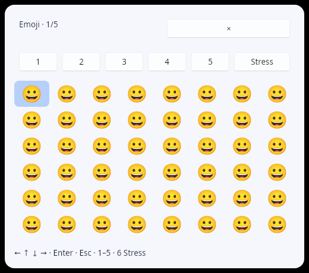
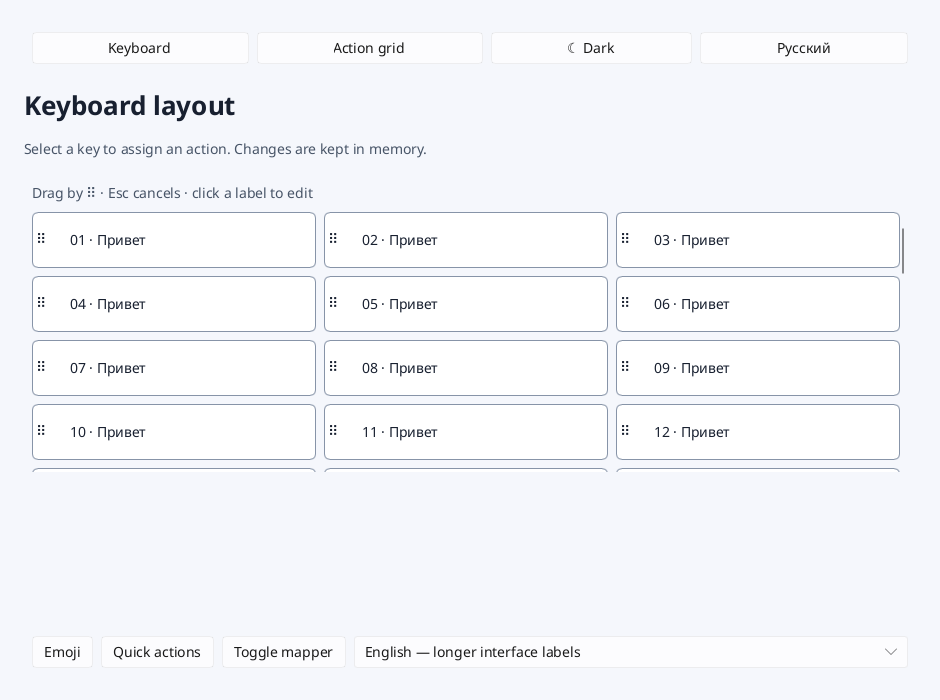
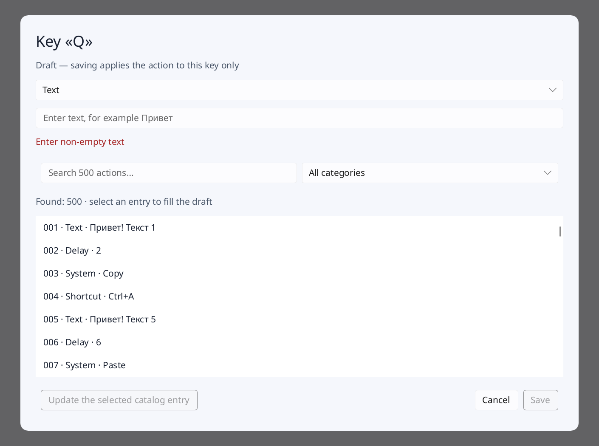
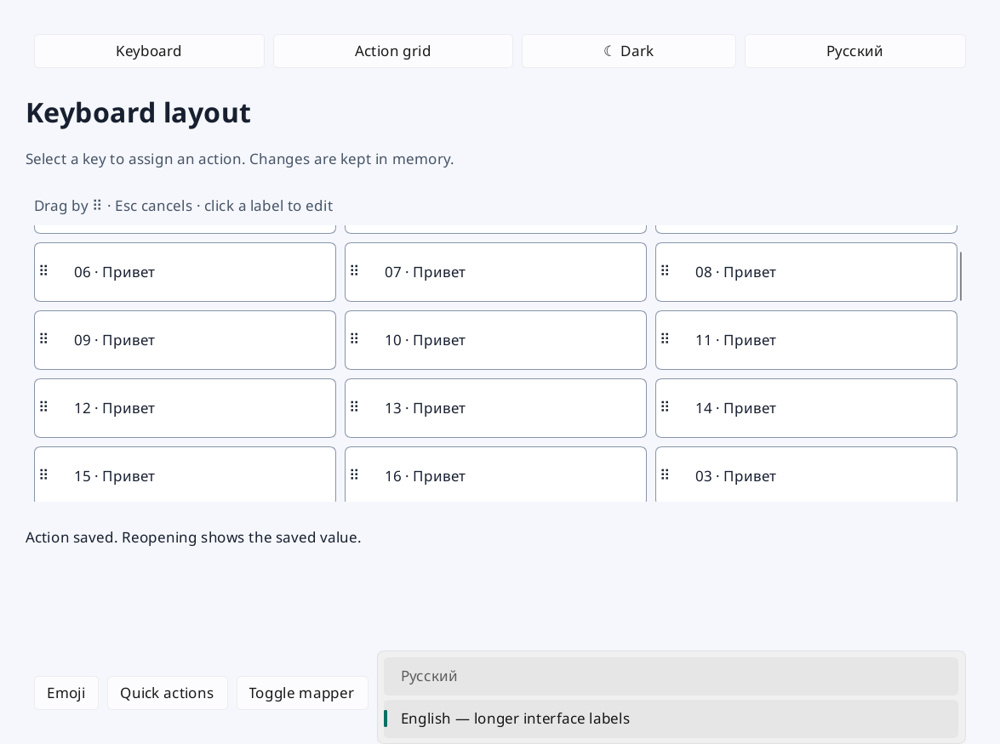
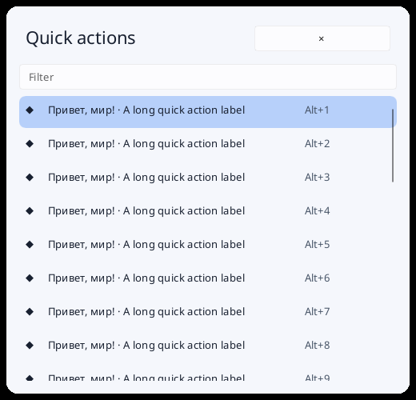
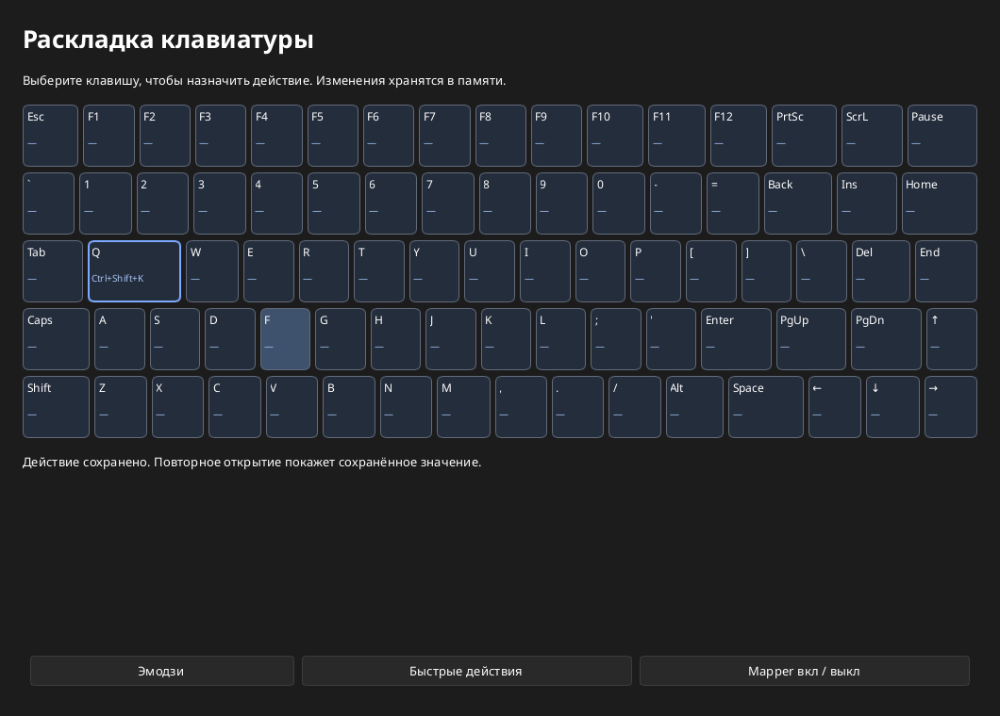
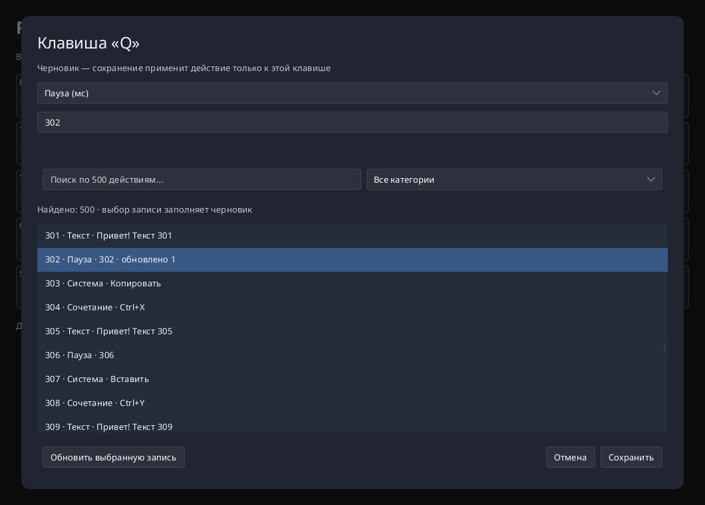

# Slint: отчёт по этапам 0–3

Дата: 2026-09-19. Реализован отдельный крейт `prototypes/slint-shell`.
Для 3C основной Tauri-процесс получил отключённый по умолчанию локальный
benchmark-канал; пользовательское поведение приложения не меняется.

## Подготовка этапа 4 — 2026-09-21

Linux-зависимости прототипа перенесены в target-specific секции Cargo, а Spell,
Wayland, evdev/uinput, ksni, zbus и тестовая клавиатура ограничены
`target_os = "linux"`. Общий `main.rs` использует платформенные интерфейсы backend,
focus, hotkey, tray, IPC и return-input; Slint UI и модель редактора не разделяются
по ОС.

Для Windows подготовлены loopback IPC на `127.0.0.1` с настраиваемым
`SLINT_SHELL_PORT`, `global-hotkey`, `tray-icon`, Win32 foreground window и
отложенный возврат Unicode-текста. После native-проверки Windows переведён с
`enigo` на clipboard + `Ctrl+V`; macOS продолжает использовать `enigo` и тот же native
hotkey/tray/input слой, восстанавливает процесс через System Events и использует
Unix socket в `XDG_RUNTIME_DIR` либо системном temporary directory. Метрики
остаются общими и не зависят от `/proc`; `/proc` используется только внешними
Linux-скриптами измерения.

В CI добавлена матрица сборки и unit-тестов отдельного Slint-прототипа на Linux,
Windows и macOS, включая release-check на Windows/macOS. Локально подтверждены
Linux test/check/clippy и Cargo dependency graph для Windows/macOS: Linux-пакеты
не входят в их normal dependency path. Полная cross-компиляция локально недоступна,
так как системный Rust установлен без foreign std targets; окончательный сигнал
дают native CI runners.

Подготовительные пункты не являются результатом минимальной платформенной
проверки. На Windows/macOS ещё требуется подтвердить требования event loop у tray
и global hotkey, возврат фокуса в ранее активное приложение и реальные Unicode/
clipboard циклы. На macOS отдельно нужны Accessibility permissions. Hyprland и
GNOME по-прежнему требуют реальных сессий.

## Частичная проверка Windows — 2026-09-21–22

Нативный проход выполнен в Windows 11 Enterprise Evaluation 25H2 на KVM/QEMU:
4 vCPU, 6 ГиБ RAM, UEFI Secure Boot, TPM 2.0, Rust/Cargo 1.98.1, Slint 1.17.1.
Использован snapshot исходников commit `d5a9a87` с локальными Windows-патчами.
Подробный checklist и оставшаяся матрица находятся в
[Windows-плане](slint-windows-validation.md), воспроизводимая настройка стенда —
в [руководстве](../docs/windows-testing.md).

Подтверждены native unit-тесты и release-сборка. Для `global-hotkey` и `tray-icon`
потребовались явные типы callback-параметров, после чего сборка прошла. Portable
`interactions` подтвердил clipboard, keyboard, modal, DnD, cancellation, edge
scrolling, theme, locale и hidden popups. Отдельный harness выполнил 100/100
чередующихся IPC show/hide и штатный `quit`.

Settings, Emoji и Quick запускаются и интерактивны. `winit-software` показал
монохромные outline emoji; `winit-skia` показал цветные Windows emoji и выбран
для дальнейшей Windows-проверки. Квадраты в части stress-каталога связаны с
генерацией непрерывных диапазонов, включающих невалидные и не-emoji code points;
каталог нужно заменить списком заведомо валидных последовательностей.

Первоначальный return-input через `enigo 0.6.1`, а затем прямой Unicode
`SendInput` искажали смешанную строку: `Действие 02 / Action 02` превращалась в
усечённый текст с повтором последней цифры. Clipboard fallback с `Ctrl+V` через
задержанный IPC корректно вставил `Действие 03 / Action 03` и отдельный emoji в
Notepad. После каждого выбора прежний текстовый clipboard `CLIPBOARD_KEEP`
восстановился. Нетекстовые clipboard formats пока не сохраняются и не проверены.

Блокер: при открытии Emoji из системного tray фокус не возвращается в ранее
активный Notepad. Эксперимент с отслеживанием последнего внешнего foreground HWND
через WinEventHook не исправил поведение и не оставлен в исходниках. Задержанный
IPC работает, но не заменяет tray-критерий. F13/ScrollLock также остаются
непроверенными: внутригостевой `SendInput` не является аппаратным событием для
валидной проверки `RegisterHotKey`.

Проход остановлен на этом блокере. Не выполнены серии в Windows Terminal и
браузере, по пять циклов на получатель, Esc/focus-loss, удерживаемые модификаторы,
DPI 125/150%, taskbar/fullscreen/второй монитор, lock/sleep и измерения ресурсов.
Windows-платформа не прошла критерий этапа. Следующий Windows-заход начинается с
получения корректного return target до открытия tray-меню и повторения разделов
6–9 Windows-плана.

## Стоимость сопровождения — 2026-09-21

Выбранная архитектура требует сопровождать два UI-процесса: настройки на winit и
оба layer-shell-попапа в одном Spell worker. Закреплены Slint 1.17.1 и локальный
Spell 1.0.6 от `c3139561519cbd78fc5ac8721e1b5a6eb6412f42`. Локальные изменения Spell
сгруппированы в шесть областей: map/unmap и возобновление кадра, ограничение frame
callbacks и пересоздание закрытого слоя, события focus/frame/closed, repeat и
синхронизация модификаторов, выбор output на правильном Wayland connection и
логический размер при смене scale. Их покрывают серии 502 lifecycle-циклов,
40 выборов + 40 отмен, repeat/модификаторы/кириллица, 16 геометрических сценариев
и release-серия 100/100 на попап.

Риск обновления высокий: Spell напрямую использует `i_slint_core`,
`i_slint_renderer_skia`, `WindowAdapterInternal`, внутренние cursor/dirty-region
типы и собственный software surface. Такая связка уже переставала собираться при
попытке Slint 1.18. Spell worker фиксирован на Skia software/Wayland SHM; выбор
`SLINT_BACKEND` относится только к winit-настройкам. Обновление нельзя считать
обычным bump: разумный бюджет — 2–4 дня на перенос патчей, сборку и сокращённую
повторную матрицу, а при изменении platform/renderer API — до 1–2 недель. До
появления принятого upstream-варианта локальная копия остаётся источником истины;
патчи следует дробить на отдельные коммиты и предлагать upstream, но не удалять
vendor до выпуска совместимой версии.

Crash-check принудительно завершает дочерний Spell-процесс, после чего вызов
попапа быстро возвращает ошибку, родитель продолжает отвечать на IPC и штатно
завершается. Ошибка теперь не только пишется в лог, но и сохраняется красным
сообщением в настройках. Автоматического перезапуска нет; для продукта нужен
supervisor с ограничением частоты рестартов и восстановлением темы/языка.

Масштаб оставшегося UI — 10 страниц, 53 Vue-компонента и 50 composables. По
результатам 3A/3B ориентир для одного разработчика: 8–12 дней на Keymap/Layouts,
8–12 на Rules/Macros/Commands, 5–8 на Settings и общую state/config-модель, 3–5
на Emoji/Quick и обобщение DnD, 3–5 на локализацию, accessibility и полировку.
Итого UI/state — примерно 27–42 рабочих дня без платформенной приёмки. Это
оценка по группам взаимодействий, а не по строкам Vue.

Отдельно придётся заменить возможности Tauri: жизненный цикл и геометрию окон,
трей, IPC/single-instance, activation/focus, пути и файловое хранение YAML,
clipboard, события Rust↔UI, системные window controls, упаковку/иконки/обновление
и platform capabilities. Linux-адаптеры частично исследованы; Windows/macOS
hotkey, focus/return-input, tray и packaging ещё не реализованы. На них разумно
заложить дополнительно 15–25 дней плюс доступ к стендам и исправление найденных
платформенных блокеров. Общий порядок оценки полного перехода — 42–67 рабочих
дней до полноценной приёмки; неопределённость Windows/macOS остаётся высокой.

Вывод раздела 5: сопровождение приемлемо для продолжения ограниченного пилота,
но локальный Spell — существенная постоянная стоимость. Планировать полный
переход до минимальных проверок Hyprland, GNOME, Windows и macOS нельзя.

## Реальная вставка 3D — 2026-09-21

Минимальный путь вставки подключён для Spell на KDE Wayland и включается через
`SLINT_SHELL_INSERT=1`. При открытии попапа KWin-скрипт запоминает исходное окно.
После выбора слой скрывается, код ждёт освобождения keyboard interactivity и
физических модификаторов, возвращает фокус только запомненному окну и вставляет
фактически выбранную строку через `wl-copy` и uinput Shift+Insert. Этот shortcut
одинаково сработал при русской раскладке в Chromium, Kate и Konsole; исходный
Ctrl+V в Konsole давал управляющий символ и был заменён. Clipboard восстанавливается
через 500 мс, чтобы приложение успело прочитать временное значение. Esc и потеря
фокуса очищают ожидающий выбор и не запускают вставку. Диагностический
`SLINT_SHELL_TEST_INJECT=1` по-прежнему отправляет `A`, поэтому исторический стенд
остаётся сопоставимым.

Реальная серия выполнена на Manjaro 7.2.3-2, KDE Plasma/KWin 6.7.4, Wayland,
масштаб 100%: Chromium 153.0.8010.36, Kate 26.08.0 и Konsole 26.08.0. Для каждой
зачётной попытки целевое окно активировалось по PID, попап вызывался основным
evdev-хоткеем, выбор делался только после `t4_focused`, а результат читался из
DOM, accessibility-текста Kate или файла терминального `cat`.

| Попап | Chromium | Kate | Konsole | Итого |
| --- | ---: | ---: | ---: | ---: |
| Emoji, значение `😀` | 5/5 | 5/5 | 5/5 | **15/15** |
| Quick, `Действие 01 / Action 01` | 5/5 | 5/5 | 5/5 | **15/15** |

Первые холодные попытки Emoji в Chromium и Kate были отправлены до готовности
фокуса и исключены как ошибка harness; обе повторены после `t4` и доставили ровно
одно значение. После исправления terminal shortcut затронутая Emoji-серия в
Konsole повторена полностью 5/5. Дополнительно прошли Emoji с зажатым до открытия
Shift и Quick через Alt+1 с зажатым до открытия Alt; после отпускания вставилось
ровно по одному значению, следующий обычный ввод подтвердил отсутствие зависшего
модификатора.

Esc и потеря фокуса проверены для обоих попапов в каждом из трёх приложений:
6/6 отмен Esc и 6/6 смен фокуса без вставки в исходное или новое окно. Метрики
содержат `hidden` без `selected_input_sent`; содержимое всех трёх целей осталось
неизменным. Меню трея и IPC по одному разу довели каждый попап до show/frame/focus.
Живой клик кнопки Emoji прошёл в основном процессе; воспроизводимый пример
`interactions` кликает обе нижние кнопки настоящего компонента настроек и проверяет
видимость Emoji/Quick. Отдельный шорткат DE не нужен: evdev является основным
глобальным путём.

Визуальный снимок с выбранным по умолчанию Skia-путём подтвердил цветные emoji,
прозрачные скруглённые углы и, после уменьшения шага строки с 48 до 44 px, все 48
элементов без обрезания. Standalone winit-прогон с `winit-software` цветные glyph
не рисует; рабочий Spell-попап использует закреплённый Skia software/SHM. Ранее
сохранённая 16-сценарная KWin-серия подтверждает нижнее размещение с отступом
24 px и `skipTaskbar=true`.



Итог 3D положительный: короткий KDE-пилот закрыт, следующий шаг — минимальные
проверки других платформ из раздела 4 плана. Это не распространяет результат
KDE/Wayland на Hyprland, GNOME, Windows или macOS. Краткий протокол сохранён в
[stage3d/verification.txt](slint-prototype-results/stage3d/verification.txt).
Для запуска:

```sh
cargo build --release --locked --manifest-path prototypes/slint-shell/Cargo.toml --features spell --bin slint-shell
SLINT_SHELL_POPUPS=spell SLINT_SHELL_INSERT=1 SLINT_BACKEND=winit-software \
  prototypes/slint-shell/target/release/slint-shell
```

Итоговая проверка: `cargo fmt --check`, 5/5 unit-тестов с feature `spell`,
`cargo clippy --all-targets --no-deps -- -D warnings`, debug-сборка бинарника и
диагностического helper, пример `interactions` с проверкой обеих кнопок и
`pnpm install --frozen-lockfile` прошли. Clippy с зависимостями по-прежнему
останавливается на известном `too_many_arguments` в сгенерированном zbus API
vendor Spell.

## Release-сравнение 3C — 2026-09-21

**Текущий вывод:** на этой KDE Wayland-машине связка Slint + Spell после прогрева
занимает примерно 52 МиБ PSS против 448–450 МиБ у текущего Tauri. Экономия около
396–398 МиБ, или 88%. Slint прошёл 100/100 повторных открытий каждого попапа с
первой стрелкой; p95 готовности к вводу составил 17,8 мс. Tauri WebView в новой
серии показал p95 61,9 мс для Emoji и 73,0 мс для Quick, с одним timeout на 300
открытий Quick. Это сильный результат в пользу продолжения пилота, но не
окончательное решение о переносе: Tauri содержит больше продукта, а его тестовая
клавиша синтетическая и не проверяет системную доставку ввода.

Условия: Manjaro Linux 7.2.3, KDE Plasma/KWin 6.7.4, Wayland, Rust 1.98.1,
pnpm 9.12.0. Slint 1.17.1 + локальный Spell 1.0.6, `winit-software` для настроек
и Skia software/SHM в Spell. Tauri 2.11.1 + Nuxt 4.4.2/WebKitGTK. Обе сборки
release получены на одной машине; во время измерений сборка не шла. PSS/RSS —
сумма корневого процесса и всех потомков из `/proc/*/smaps_rollup`. Приведена
медиана трёх независимых запусков, в скобках — весь диапазон.

| Состояние | Slint PSS, МиБ | Tauri PSS, МиБ | Разница Slint − Tauri |
| --- | ---: | ---: | ---: |
| После запуска и скрытия | 24,8 (24,5–25,1) | 303,6 (289,7–303,6) | −278,8 МиБ / −91,8% |
| Оба попапа показаны и скрыты | 52,0 (52,0–52,3) | 450,0 (408,8–453,5) | −398,0 МиБ / −88,4% |
| Настройки открыты | 52,0 (51,9–52,3) | 448,4 (408,8–452,8) | −396,4 МиБ / −88,4% |
| Настройки снова скрыты | 52,0 (51,7–52,3) | 447,1 (407,6–451,6) | −395,1 МиБ / −88,4% |

Slint использует два процесса, Tauri — шесть до создания попапов и восемь после.
Точка настроек не симметрична: Slint показывает пилотный редактор с каталогом из
500 записей, Tauri — существующий более функциональный продукт. У Tauri каждый
попап создаёт отдельное WebKit-дерево и остаётся прогретым после hide. GPU-память
в PSS не учтена.

Release-серия реального evdev-вызова Slint/Spell:

| Попап | Успех | t3 first frame p50/p95/max | t4 focus p50/p95/max | t5 first key p50/p95/max |
| --- | ---: | ---: | ---: | ---: |
| Emoji | 100/100 | 4,8 / 7,1 / 63,7 мс | 6,3 / 10,8 / 66,0 мс | 12,7 / 17,8 / 73,9 мс |
| Quick | 100/100 | 4,7 / 6,3 / 18,3 мс | 6,4 / 10,3 / 20,6 мс | 12,4 / 17,8 / 23,1 мс |

Сопоставимый WebView-маркер Tauri добавлен после первой серии. Три независимых
release-запуска дали следующие результаты на 300 повторных открытиях каждого
попапа:

| Попап | Успех до t5 | t3 double-rAF p50/p95/max | t4 focus p50/p95/max | t5 synthetic key p50/p95/max |
| --- | ---: | ---: | ---: | ---: |
| Emoji | 300/300 | 40,4 / 57,1 / 85,1 мс | 42,0 / 60,1 / 89,7 мс | 43,5 / 61,9 / 94,3 мс |
| Quick | 299/300 | 42,4 / 68,0 / 80,6 мс | 44,6 / 70,5 / 84,8 мс | 46,9 / 73,0 / 88,1 мс |

Первое открытие после запуска до `t5`: Emoji 586,7 / 658,6 / 557,2 мс, Quick
420,3 / 547,4 / 465,0 мс. Это все три значения, не p95. Один повтор Quick не
прислал ни одного WebView-маркера за двухсекундный timeout; попытка остаётся в
результате как провал. Повторное открытие настроек по прежнему API-маркеру во
всех трёх сериях: p95 3,2 / 4,3 / 0,8 мс, но готовность формы к вводу отдельно
не инструментирована.

`t3` у Spell означает render + commit, не presentation. Стенд посылает стрелку
только после наблюдения `t4`, поэтому `t5` включает 5-миллисекундный опрос и
эмуляцию; пропусков нет. Максимум Emoji 73,9 мс — единичный выброс, ниже порога
150 мс. В изолированном KWin release-страница 1500 emoji приняла следующую стрелку
через 11,6 мс после `stress_page`; полный input/return smoke завершился успешно.
Это подтверждает устранение debug-задержки около 2,6 с в проверенном сценарии,
но не является метрикой presentation всего тяжёлого кадра.

У Tauri `t3` — два `requestAnimationFrame` после загрузки данных и сброса
прокрутки, а не подтверждение presentation WebKit/композитором; `t4` —
`document.hasFocus()`, `t5` — прохождение программно отправленного `keydown`
через тот же обработчик страницы. Поэтому Tauri-цифры показывают готовность
WebView-кода после показа и заметно ближе к целевой метрике, чем возврат API, но
не проверяют доставку физического/evdev-ввода. Slint-серия в этом отношении
сильнее и остаётся основной проверкой реального ввода.

Управляющий harness первоначально также сделал по 100 повторных show/hide. Его
p95 ответа команды у Slint: Emoji 8,4 мс, Quick 9,9 мс, настройки 15,0 мс; у
Tauri до добавления WebView-маркеров: 3,1, 3,8 и 3,1 мс. Эти старые числа
фиксируют только возврат из show/focus API и не заменяют таблицу готовности выше.

За короткое 5-секундное окно прогретого скрытого простоя суммарный CPU составил
2,6–3,0% одного ядра у Slint и 1,8–3,0% у Tauri. Постоянной загрузки ядра нет,
но это короткий и шумный замер; для исследования фоновых wakeup нужен отдельный
длительный профиль. Сырые CSV сохранены в
[`slint-prototype-results/release-3c`](slint-prototype-results/release-3c/).

### Воспроизведение

```sh
cargo build --release --locked --manifest-path prototypes/slint-shell/Cargo.toml --features spell --examples --bin slint-shell
pnpm install --frozen-lockfile
pnpm generate
pnpm exec tauri build --no-bundle
for kind in slint tauri; do
  for run in 1 2 3; do
    scripts/release-compare.py "$kind" "/tmp/lhc-release/$kind-$run"
  done
done
# Новая Tauri-серия сохраняет readiness.csv и first-readiness.csv:
for run in 1 2 3; do
  scripts/release-compare.py tauri "/tmp/lhc-tauri-ready-$run"
done
SLINT_SHELL_POPUPS=spell SLINT_BACKEND=winit-software SLINT_SHELL_BENCH_COUNT=100 \
  prototypes/slint-shell/target/release/examples/bench-evdev \
  prototypes/slint-shell/target/release/slint-shell /tmp/slint-release.csv
python3 prototypes/slint-shell/scripts/summarize.py /tmp/slint-release.csv.spell.csv
SLINT_SHELL_BIN="$PWD/prototypes/slint-shell/target/release/slint-shell" \
SLINT_SHELL_BENCH_RETURN_BIN="$PWD/prototypes/slint-shell/target/release/examples/bench-return" \
  prototypes/slint-shell/scripts/bench-virtual.sh /tmp/slint-stress-release input
```

## Взаимодействия 3B — 2026-09-20

**Текущий вывод:** реализация 3B завершена в отдельном прототипе. Автоматизированный проход на Slint 1.17.1 / winit-software / Xvfb проверяет формы, DnD и переключения; отдельный запуск в KDE Wayland проверяет передачу темы и языка в Spell 1.0.6. Это не полная ручная приёмка KDE: физический ввод, Wayland clipboard и IME остаются ограничениями проверки. Решение о переносе по-прежнему требует 3C–3D.

### Что добавлено

- Сетка из 60 редактируемых быстрых действий: перенос за ручку, индикатор вставки, прокрутка у верхнего/нижнего края, отмена Esc и при отмене pointer sequence. Порядок и подписи живут в Rust `VecModel` и сохраняются при повторном открытии вкладки; диск не используется. Отпускание после переноса не открывает редактор подписи.
- Модальная форма с возвратом фокуса к выбранной клавише, Enter для сохранения валидного текста, Esc для отмены и стрелками в каталоге. При захвате Enter/Esc становятся значением сочетания; форма остаётся открытой, после отпускания клавиши фокус возвращается в модалку. Скрытый фон исключается из дерева формы.
- Единые токены `Theme` и применение `Palette.color-scheme` к стандартным виджетам. Переключение без пересоздания окон, включая скрытые Emoji/Quick.
- Штатная локализация Slint: `@tr`, встроенный `translations/ru/LC_MESSAGES/slint-shell.po`, `select_bundled_translation`. Английский — исходный язык UI, русский выбирается при старте. Категории и системные значения каталога имеют обе подписи; пользовательский текст не переводится. IPC-команды `preferences dark|light ru|en` применяются к обоим попапам дочернего процесса.

### Фактические проверки

| Проверка | Результат и границы |
| --- | --- |
| Rust unit tests, `--features spell --bin slint-shell` | 5/5; добавлены перестановка к началу/концу и защита от недопустимых индексов |
| Старый `editor --smoke` | Прошёл: 80 клавиш, 500 записей, четыре типа, черновик, валидация, сохранение/отмена и точечное обновление |
| Новый `interactions` | Прошёл на 100%, 125%, 150%: кириллица через `KeyPressed`, выделение Ctrl+A, Ctrl+C → удаление → Ctrl+V, Tab/Shift+Tab, Enter, Esc, возврат фокуса, стрелки каталога, захват Enter/Esc |
| DnD | События указателя проходят через UI: перестановка, отмена без изменения модели, удержание у края и перенос после прокрутки; отдельно проверены переименование и сохранение порядка при повторном открытии |
| Размер и масштаб | Минимальные 940×700 логических px; снимки 940×700, 1175×875 и 1410×1050. Поля, длинные подписи, ручки, скролл и нижние кнопки доступны; выпадающий список возле нижнего края остаётся внутри окна |
| Тема и ru/en | Снимки настроек и обоих Winit-попапов в dark/ru и light/en; смена состояния при скрытых попапах и повторный показ |
| Spell IPC, реальная KDE Wayland-сессия | Тема/язык применены при `visible=None`, `Some("emoji")` и `Some("quick")`, затем оба попапа повторно открыты после изменения в скрытом состоянии; штатное завершение родителя и worker |
| Основной проект | `pnpm install --frozen-lockfile` прошёл. `pnpm dev` корректно отказал из-за занятого 3010; уже работающий сервер ответил HTTP 200. Новый чистый запуск Nuxt не подтверждён. Tauri/bridge не менялись, release-сборки оставлены для 3C |

События теста отправляются через Slint `Window::dispatch_event`, а clipboard обслуживает настоящий X11 backend в изолированном Xvfb. Это не evdev и не физическая клавиатура. Попытки того же синтетического сценария в пользовательской Wayland-сессии оказались нестабильны для clipboard и удержания указателя; их не засчитываем. Нужен короткий ручной проход в основной KDE-сессии. Orca computer-use в этой среде не предоставляет screenshots/hotkey и не показал Slint в списке приложений, поэтому OS-level проверка через него не подтверждена.

IME не проверен: работающие `fcitx5`/`ibus-daemon` не обнаружены, настроенная среда ввода не подтверждена. Проверка перенесена в платформенную приёмку. Цветные emoji в software-рендерере не считаются подтверждёнными: на снимках текстовых полей emoji отсутствует, как и в 3A; проверка выбранного release-рендерера и Spell остаётся в 3C/3D.

Снимки получены из рендерера, не захватом рабочего стола:









### Стоимость и обходы

Собственная инфраструктура DnD — один компонент `quick-grid.slint` (около 110 строк), единый `TouchArea` поверх области просмотра, таймер только на время переноса и небольшая перестановка Rust-модели. Вариант с отдельными обработчиками внутри прокручиваемых карточек не прошёл проверку событий и был заменён. Это внутренний DnD, без переноса файлов и межпрограммного протокола. При порте нескольких сеток компонент стоит обобщить; новый фреймворк не потребовался.

Формы, clipboard и ComboBox используют стандартные виджеты; вручную реализованы modal scope, возврат фокуса и защита захвата клавиш. Переводы встроены штатным компилятором Slint, IPC использует существующий канал. Изменения локальной копии Spell для 3B не понадобились. Такой объём собственного кода пока приемлем для продолжения короткого пилота; он не доказывает готовность всех экранов и accessibility.

По журналу инструментов первый интервал реализации/проверок — 20 сентября 20:59–21:18 UTC, продолжение — 21 сентября примерно с 01:52 UTC. Пауза между ними не считается временем реализации; интервалы включают сборки. Это порядка 35–40 минут работы на данном стенде, без точного учёта первоначального чтения и без оценки ручной приёмки. Оценки остальных экранов из 3A пока сохраняются: 3B не выявил необходимости отдельной большой DnD-подсистемы, но нативные различия ещё не закрыты.

### Воспроизведение из корня репозитория

```sh
cargo test --locked --manifest-path prototypes/slint-shell/Cargo.toml --features spell --bin slint-shell
cargo build --locked --manifest-path prototypes/slint-shell/Cargo.toml --features spell --bin slint-shell --example editor --example interactions
xvfb-run -a env -u WAYLAND_DISPLAY SLINT_BACKEND=winit-software prototypes/slint-shell/target/debug/examples/editor --smoke
for scale in 1 1.25 1.5; do
  xvfb-run -a -s '-screen 0 1920x1200x24' env -u WAYLAND_DISPLAY SLINT_BACKEND=winit-software SLINT_SCALE_FACTOR="$scale" prototypes/slint-shell/target/debug/examples/interactions
done
python prototypes/slint-shell/scripts/check-preferences.py
pnpm install --frozen-lockfile
pnpm dev
```

`check-preferences.py` запускать в KDE Wayland с доступным layer-shell: он временно показывает оба попапа, отключает evdev-хоткеи тестового экземпляра и использует отдельный socket. Необязательный первый аргумент — каталог логов/CSV. Для снимков `interactions` создать каталог и передать `LHC_EDITOR_SNAPSHOTS`; формат PPM. При принудительном `SLINT_SCALE_FACTOR` стенд задаёт физический размер с учётом масштаба, чтобы действительно проверять минимальные логические размеры, а не случайно уменьшать их.

Для ручного просмотра редактора:

```sh
SLINT_BACKEND=winit-software prototypes/slint-shell/target/debug/examples/editor
```


## Редактор 3A — 2026-09-20

**Текущий вывод:** репрезентативный редактор реализован в отдельном Slint-прототипе. Это закрывает реализацию 3A, но не является решением о переносе продукта: 3B–3D и платформенные проверки остаются открытыми.

Пять рядов по 16 клавиш с hover, выделением и открытием редактора; текст, пауза 1–10000 мс, выбор системного действия и захват сочетания. Черновик хранится отдельно от сохранённых назначений: отмена его отбрасывает, повторное открытие восстанавливает сохранённое действие. Некорректные значения блокируют сохранение и повторно проверяются в Rust. Захват принимает Enter/Esc как часть значения, не как подтверждение/закрытие формы. Данные живут только в памяти.

Каталог содержит 500 записей четырёх категорий. Поиск регистронезависимый, в том числе по кириллице. Выбор копирует значение в черновик. Кнопка обновления меняет счётчик ревизии одной записи через `VecModel::set_row_data`; это проверка точечного обновления, не редактор всего каталога. Стабильный ID сохраняет выделение; `ListView` сохраняет позицию при обновлении строки. Смена фильтра намеренно заменяет список результатов.

Компоненты/модель: `ui/settings.slint` содержит клавиатуру и редактор поверх неё; `src/editor.rs` — сохранённые назначения, каталог, валидацию и регистрацию callbacks. `examples/editor.rs` запускает тот же UI отдельно от IPC/трея/mapper и выполняет воспроизводимый smoke-проход. Новых зависимостей нет, версии Slint/Spell не менялись.

### Проверка 3A

- `cargo test --features spell --bin slint-shell`: 4/4, включая два теста редактора (изоляция черновика, сохранение/валидация, фильтрация и идентичность строк при обновлении).
- Native winit/software, Slint 1.17.1, debug, окно 1060×760: автоматизированный проход всех четырёх типов через callbacks; открытие Q событием указателя; Ctrl+Enter и Esc через `WindowEvent` и настоящий `FocusScope`. Это события внутри Slint, не физический ввод через evdev.
- Список прокручен к записи 302; точечное обновление сохраняет выбранный ID и смещение viewport. Отрисовка после обновления подтверждена снимком.
- Снимки получены через `Window::take_snapshot`, а не захват рабочего стола. Основные элементы не обрезаны. Кириллица видна; цветной emoji в software-снимке текста не отображается — проверка рендереров/шрифтов остаётся в пилоте.
- Orca computer-use не обнаружил отдельное Slint-окно в дереве приложений. Ручной проход средствами OS accessibility не подтверждён; снимки и тесты Slint не заменяют эту проверку.
- `pnpm install` выполнен успешно. Новый `pnpm dev` корректно отказал из-за занятого порта 3010; существующий сервер отвечает HTTP 200. Новый чистый запуск Nuxt не подтверждён. Tauri/bridge не менялись, production-сборки относятся к 3C и здесь не запускались.





Воспроизведение из корня репозитория:

```sh
cargo test --manifest-path prototypes/slint-shell/Cargo.toml --features spell --bin slint-shell
SLINT_BACKEND=winit-software cargo run --manifest-path prototypes/slint-shell/Cargo.toml --features spell --example editor -- --smoke
SLINT_BACKEND=winit-software cargo run --manifest-path prototypes/slint-shell/Cargo.toml --features spell --example editor
```

Для снимков создать каталог и передать его через `LHC_EDITOR_SNAPSHOTS`; smoke сохранит `keyboard.ppm` и `editor.ppm`. В полном shell редактор открывается прежней командой `show settings`.

### Трудоёмкость и оставшийся перенос

Работа выполнена за два интерактивных захода с длительной паузой между ними. Зафиксированный первый участок исправлений сборки и проверок — 16:08–16:12 UTC; продолжение — после 20:51 UTC. Точное активное время первоначального написания не замерялось, поэтому суммарное время реализации не выдаётся за измеренное. Для следующего этапа нужен отдельный таймер активной работы; этот опыт пока показывает структуру работ, а не производительность полного переноса.

Ручные решения: сетка клавиш и overlay на `Rectangle`/`TouchArea`, отдельный `FocusScope` для захвата с нормализацией имён клавиш, собственная фильтрация и callbacks для черновика. Стандартные поля, кнопки, списки и ComboBox взяты из Slint. Исправления Spell для редактора не потребовались. Геометрия клавиш пока условная (равные ширины), modal focus trap и клавиатурная навигация каталога требуют этапа 3B.

Предварительная инженерная оценка для одного разработчика, **не замер и не обязательство по срокам**, с проверкой поведения и доработкой после 3B:

| Группа | Оставшаяся работа | Порядок трудоёмкости |
| --- | --- | --- |
| Раскладки, слои, редактор действий | Реальная геометрия, полный каталог, типы действий, операции над слоями | 3–6 рабочих дней |
| Quick/Emoji | Редактирование коллекций, DnD, поиск и порядок | 3–6 дней; уточнить после 3B |
| Макросы, команды, правила | Вложенные формы, ссылки, валидация и зависимости | 5–10 дней |
| Общие настройки и диагностика | Формы, статусы, ошибки и отображение разрешений | 2–4 дня |
| Общая инфраструктура | Конфиг, сохранение, тема, локализация, навигация, доступность | 5–10 дней, перекрывается с экранами |

Это диапазоны по рискам взаимодействий и модели состояния, не экстраполяция строк Vue. Нативные адаптеры Windows/macOS, упаковка, замена возможностей Tauri и приёмка не включены; для них данных 3A недостаточно. Общую дату окончания из этой таблицы выводить нельзя.

---

## Выполнено

- Этап 0: один Slint event loop, три UI-компонента создаются при старте,
  окна скрыты; обмен с IPC/evdev/треем через UI event loop; software/femtovg/skia;
  CSV с отдельными таймингами startup/show/frame/focus/key.
- Этап 1: ksni StatusNotifierItem, меню, переключение настроек кликом,
  зелёная/серая иконка, явный выход. Процесс продолжает работать после скрытия окон.
- Этап 2: Emoji 5×48 + stress 1500; Quick 30 строк с фильтром;
  стрелки, выбор, Esc, скрытие при потере фокуса; прозрачный фон, скругления,
  запрос always-on-top; Utility на X11. Выбор выводится в лог.
- Этап 3: кнопка с запросом activation token; F13/ScrollLock через evdev;
  Unix socket с передачей XDG_ACTIVATION_TOKEN и вызовом xdg_activation_v1.activate.
  Добавлены повторные IPC-открытия, evdev/uinput-проверка и сводка CSV.

Код этапов 0–3 реализован. Полная ручная матрица этапа 3 по разным DE и исходным
приложениям **не завершена**. Этапы 4–7 не реализованы.

## Среда и ограничения замеров

KDE KWin 6.7.4, Wayland; Rust 1.98.1; Slint 1.18.0 / winit 0.30.13;
debug-сборка со всеми тремя рендерерами и accessibility. Noto Color Emoji установлен.

Это smoke-проверки, не итоговый performance benchmark:
во время IPC-серий работала компиляция/clippy, сессия не была изолирована от
пользовательского ввода. Задержка до hide в IPC-тесте — 500 мс. Медленный рендерер
может не успеть получить фокус до закрытия. Пороги плана по этим цифрам оценивать нельзя.
Release, baseline Tauri, GPU memory, cold exec, размер release-бинарника и полное
время clean build пока не измерялись.

### Фокус и тайминги

Все значения времени — `t4_focused - t0_trigger`, мс.
Percentiles считаются **только по вызовам, где t4 был получен**.
Событие фокуса само по себе не доказывает, что фокус сохранился до первой клавиши.
Исходные данные: [CSV](slint-prototype-results/).

| Серия | Попап | Focused / вызовы | Обработана стрелка | p50 | p95 | max |
| --- | --- | --- | --- | --- | --- | --- |
| software | emoji | 19/20 | 0 | 54.7 | 109.9 | 109.9 |
| software | quick | 19/20 | 0 | 66.9 | 155.4 | 155.4 |
| femtovg | emoji | 0/20 | 0 | — | — | — |
| femtovg | quick | 5/20 | 0 | 506.5 | 508.8 | 508.8 |
| skia | emoji | 19/20 | 0 | 249.5 | 462.9 | 462.9 |
| skia | quick | 19/20 | 0 | 195.5 | 249.5 | 249.5 |
| software-evdev | emoji | 19/20 | 3 | 70.1 | 247.0 | 247.0 |
| software-evdev | quick | 19/20 | 19 | 60.6 | 164.6 | 164.6 |
| software-buttons | emoji | 20/20 | 0 | 51.4 | 68.9 | 71.1 |
| software-buttons | quick | 19/20 | 0 | 52.5 | 82.3 | 82.3 |

- `software-buttons`: 20 вызовов каждого попапа через реальные Slint callbacks,
  активированные семантическим AT-SPI click из Orca. Перед кликом настройки
  получали фокус (40/40). Лог подтверждает выдачу токена winit и отправку
  xdg_activation_v1.activate. Это не физический клик и не проверка поверх
  терминала/браузера/IDE. Стрелка в этой серии не отправлялась.
- `software-evdev`: временная uinput-клавиатура, реальные evdev события,
  без activation token. При наличии t4 и отсутствии hidden отправлялась стрелка.
  Emoji в большинстве вызовов терял фокус до проверки.
  t5 включает искусственное ожидание 400 мс; это проверка доставки клавиши,
  а не минимальной задержки готовности к вводу.
- Обычный IPC-тест запускался из shell без токена. Transport токена и отправка
  Wayland activate дополнительно проверены с тестовым невалидным токеном;
  это **не доказывает**, что глобальный шорткат KDE выдаёт рабочий токен.
  Серия 20/20 с токеном, выданным именно DE при запуске команды, остаётся ручной.
- Для software rendering notifier возвращает Unsupported: t3 не записывается.
  Для GPU-рендереров t3 присутствует, пропуски не подменяются t2.

### Память сразу после старта, все окна скрыты

Один процесс, /proc/PID/smaps_rollup, MiB, debug. Без GPU allocation accounting.

| Рендерер | PSS | RSS |
| --- | --- | --- |
| software | 48.5 | 56.3 |
| femtovg | 83.9 | 123.4 |
| skia | 70.7 | 96.4 |

Остальные точки памяти из этапа 7 не измерялись.

## Нативное поведение

| Проверка | KDE Wayland |
| --- | --- |
| Регистрация StatusNotifierItem | Подтверждена через session D-Bus |
| Переключение иконки | IconPixmap изменился после toggle-mapper |
| Activate трея | Вызов обработан; настройки скрываются |
| Жизнь без видимых окон | Подтверждена сериями show/hide |
| GTK/WebKit | Не найдены в ldd debug-бинарника |
| Цветные эмодзи, скругления, прозрачность | Код есть, визуально не подтверждено |
| Поверх окон / отсутствие кнопки панели | Запрошено, эффект композитора не подтверждён |
| Центр / курсор / возврат фокуса / инжект | Этапы 4–5, не проверялись |
| Hyprland / KDE X11 / GNOME / fractional scale | В этой сессии не проверялись |

Скриншотов нет: доступный computer-use provider не поддерживает захват.
AT-SPI подтвердил наличие сетки 48 эмодзи и элементов настроек; это не доказательство
цветной отрисовки. Фильтрация, stress-страница, Enter/Esc и внешний вид требуют
дополнительной интерактивной приёмки. Автоматически подтверждена обработка стрелок.

## Обнаруженные особенности и исправления

1. Slint сохраняет UI-компонент при hide, но на Wayland уничтожает native window.
   Повторный show включает создание поверхности. Ready в CSV означает создание
   UI-компонента, не готовность нативного окна к вводу.
2. Hook WindowAttributes применяется при создании адаптера. Его нельзя использовать
   для нового activation token на каждом повторном показе. Реализована отправка
   xdg_activation_v1.activate через заимствованный display и surface winit.
3. Скрытие прямо внутри winit event filter могло приводить к panic AccessKit.
   Закрытие по фокусу/клавишам перенесено в следующую итерацию event loop, с проверкой
   номера текущего замера. После исправления — 120 IPC-открытий без падений,
   дополнительно 40 evdev и 40 кнопочных вызовов.
4. Always-on-top и Utility не дают переносимой гарантии для Wayland.
   В README описаны параметры возможного правила KWin; правила не применялись.
5. Потерянный фокус — реальное ограничение этой серии. Не следует делать вывод
   «фокус работает» по одному успешному show или считать результаты IPC эквивалентом
   реального хоткея.

## Проверки и воспроизведение

```sh
cargo build --locked --manifest-path prototypes/slint-shell/Cargo.toml
cargo test --locked --manifest-path prototypes/slint-shell/Cargo.toml
cargo clippy --locked --manifest-path prototypes/slint-shell/Cargo.toml --all-targets -- -D warnings
cargo fmt --manifest-path prototypes/slint-shell/Cargo.toml --check
pnpm install --frozen-lockfile
```

Build, тест изоляции CSV trials, clippy прошли. Команды запуска/замеров и требования
к input/uinput: [README прототипа](../prototypes/slint-shell/README.md).

`pnpm install --frozen-lockfile` прошёл. `pnpm dev` корректно отказался запускать
второй сервер: порт 3010 уже занят Nuxt из этого же репозитория.
Существующий сервер отвечает HTTP 200 на http://localhost:3010.
Tauri build/dev не запускались: src-tauri, bridge и production build не изменялись.

## Решение

Решение о миграции пока не принято. Каркас пригоден для дальнейшей проверки,
но стабильность фокуса всех способов вызова не доказана. Следующий шаг —
ручная матрица этапа 3 с первой стрелкой, реальным глобальным шорткатом DE,
другими исходными окнами и Hyprland; затем решение о необходимости layer-shell.
Оценку стоимости порта настроек/i18n/HiDPI имеет смысл делать после этапа 6.

## Этап 3а: Slint + Spell

Ниже сохранены исходные результаты 19 сентября. Актуальные исправления и проверки —
[в дополнении от 20 сентября](#результаты-доработки-3а-2026-09-20).

**2026-09-19. Этап не принят.** Создан и проверен измерительный вариант с двумя
backend-процессами, но обязательные 20/20 по evdev/первой клавише не достигнуты
на доступном KDE Wayland. Наличие layer-shell само по себе проблему не решило.
Решение о миграции остаётся открытым; этот результат не является отказом от Slint
вообще, но зафиксированный Spell требует доработки lifecycle/input до продолжения
приёмки попапов.

### Реализация и совместимость

- Зафиксированы Slint **1.17.1** и Spell **1.0.6** из Git revision
  `c3139561519cbd78fc5ac8721e1b5a6eb6412f42`. Попытка со Slint 1.18 не собирается:
  Spell импортирует `i_slint_core::items::MouseCursor`, которого там больше нет.
  Основное Tauri/Nuxt-приложение не изменялось. Исторические цифры выше относятся
  к старой версии прототипа на Slint 1.18.
- Winit обслуживает настройки и ksni-трей, дочерний процесс Spell — два попапа.
  Переключения backend внутри одного процесса нет. IPC сохраняет источник вызова
  и время триггера; время передачи между процессами включено в t1/t4/t5. Для
  переноса времени используется SystemTime, поэтому изменение системных часов
  во время серии исказит межпроцессные задержки.
- `SLINT_SHELL_POPUPS=auto` проверяет Wayland registry и при отсутствии layer-shell
  оставляет обычные окна winit; `spell` требует протокол. По умолчанию остаётся
  прежний `winit`. Fallback GNOME реализован как маршрут выбора backend, но его
  центрирование, активация и рабочий цикл на Mutter **не подтверждены**.
- Рендерер Spell — Skia в software surface с буфером SHM. Переменная
  `SLINT_BACKEND` выбирает рендерер только родительского winit. Раздельные CSV и
  `mem.sh` с обходом потомков учитывают двухпроцессную архитектуру.
- Оба UI используют прежние `.slint`-компоненты. Обработка Quick перенесена из
  фильтра winit в LineEdit, добавлены Alt+1…9 для первых девяти результатов.
  Enter/Esc и переключение попапов не выполняют реальных действий.
- t4 в Spell фиксируется после пересылки backend-события keyboard enter в Slint
  WindowActiveChanged. Источник — tracing-сообщения закреплённой версии Spell,
  а не winit accessor. `leave` до нового `enter` учитывается отдельно и не
  закрывает новый trial. Эта инструментальная связка требует пересмотра при
  обновлении Spell. t5 и navigation_handled подтверждают обработанную клавишу.
- Rendering notifier зарегистрирован, но AfterRendering в этих сериях не получен.
  **t3 недоступен**; t2 означает только отправленный запрос показа.

Исходники проверенной версии: [Spell](https://github.com/VimYoung/Spell/tree/c3139561519cbd78fc5ac8721e1b5a6eb6412f42/spell-framework),
[обработка ввода](https://github.com/VimYoung/Spell/blob/c3139561519cbd78fc5ac8721e1b5a6eb6412f42/spell-framework/src/wayland_adapter/window/input.rs),
[lifecycle](https://github.com/VimYoung/Spell/blob/c3139561519cbd78fc5ac8721e1b5a6eb6412f42/spell-framework/src/wayland_adapter/window.rs).

### Результаты KDE Wayland

Доступен один eDP-1, 1920×1080, scale 1.0. Результаты относятся к текущей сессии;
отдельные серии поверх терминала, браузера и IDE не проведены. Провайдер
computer-use не поддерживает скриншоты; дерево настроек этого запуска через
AT-SPI также не получено. Визуальные свойства не считаются подтверждёнными.

1. **Штатный unmap lifecycle Spell:** окна создаются скрытыми; после show_again
   настройки уходят композитору, но нет нового buffer attach и keyboard enter.
   Повторная серия на итоговом коде: 0/20 для каждого попапа
   ([CSV](slint-prototype-results/stage3a/unmap-evdev.csv)). Диагностический запуск с первым
   открытым окном получает keyboard enter и обрабатывает стрелку: проблема
   предварительного скрытия отделена от отсутствия layer-shell/activation token.
2. **Экспериментальный transparent lifecycle:** слой остаётся mapped. При скрытии
   содержимое невидимо, input region пуст, keyboard interactivity None; при показе
   содержимое и input region восстанавливаются, запрашивается Exclusive.
   Это обход проблемы unmap, с дополнительной работой постоянно живых поверхностей.
   Он доступен в прототипе, но требование стабильного ввода также не проходит.
3. В трассе подтверждены запросы: 520×460 и 520×500, overlay=3, bottom anchor=2,
   margin `(0,0,24,0)`, exclusive zone=0. Композитор прислал configure с этими
   размерами. Это **не доказательство** координат относительно панели, положения
   над fullscreen или отсутствия изменения геометрии других окон.
   См. [фильтрованную трассу](slint-prototype-results/stage3a/protocol.txt).
4. Запуск с `SLINT_SHELL_OUTPUT=eDP-1` не упал. При последовательных IPC-вызовах
   одного попапа t4 появился лишь 1/20 для Emoji и 1/20 для Quick. Фактический
   выбор монитора при наличии второго выхода этим не подтверждён.

Финальная evdev-серия с transparent lifecycle, без activation token; первая
стрелка посылается при новом t4, опрос CSV каждые 5 мс, таймаут 2 с:

| Попап | t4, N/20 | Первая стрелка, N/20 | t4 p50 / p95 / max, мс | t5 p50 / p95 / max, мс |
| --- | --- | --- | --- | --- |
| Emoji | 9/20 | 9/20 | 5.289 / 23.963 / 23.963 | 16.600 / 29.810 / 29.810 |
| Quick | 7/20 | 6/20 | 10.602 / 27.893 / 27.893 | 16.861 / 39.168 / 39.168 |

Процентили рассчитаны **только по полученным событиям**, не по всем 20 попыткам.
Они не означают, что критерий p95 готовности выполнен: пропущенные попытки провальны.
Тест завершился с ошибкой `25/40 trials failed focus/navigation`.
[CSV evdev](slint-prototype-results/stage3a/transparent-evdev.csv).

500 **чередующихся** IPC-циклов плюс два прогревочных показа завершились без падения:
Emoji t4 251/251 (p50 3.694, p95 10.309, max 24.219 мс), Quick t4 251/251
(p50 5.988, p95 15.612, max 109.386 мс). Клавиши в этой серии не отправлялись,
поэтому успешное чередование не заменяет провал повторного открытия одного окна.
[CSV 500 циклов](slint-prototype-results/stage3a/transparent-500.csv),
[CSV с явным монитором](slint-prototype-results/stage3a/explicit-output-ipc.csv).

### Память: transparent lifecycle, debug, всё дерево

| Точка | Процессов | RSS, КиБ | PSS, КиБ |
| --- | --- | --- | --- |
| Простой после старта | 2 | 99352 | 55974 |
| После запроса Emoji | 2 | 126636 | 81222 |
| После запроса Quick | 2 | 126864 | 81318 |
| Прогреты, скрыты | 2 | 126868 | 81322 |
| После 500 чередующихся циклов | 2 | 126212 | 80729 |

Рост после прогрева отсутствует в этой серии (−593 КиБ PSS). Это не проверка
недельной работы или полного цикла выбора/инжекта. Порог ≤40 МиБ в простое не
достигнут в данном двухпроцессном debug-варианте. Родитель сохраняет также свои
скрытые winit-компоненты попапов; это измеренная конфигурация, не оценка минимально
возможной памяти будущего приложения. CPU/GPU память отдельно не измерялась.
[Исходные измерения](slint-prototype-results/stage3a/memory.csv).

### Непройденная и оставшаяся приёмка

| Требование | Статус |
| --- | --- |
| Evdev без токена, 20/20 и первая клавиша | **Не пройдено на KDE** |
| Жизнь скрытого процесса, IPC, 500 чередований | Подтверждено; ограниченный сценарий |
| Трей + winit-настройки одновременно со Spell | Процессы/регистрация работают; полный интерактивный цикл не принят |
| Кнопка / реальное меню трея / шорткат DE, по 20 вызовов | Маршрутизация реализована; отдельные серии не проведены |
| Фактические координаты, панель, fullscreen, внешний вид, цвет эмодзи | Не подтверждено |
| Два монитора / отключение / scale 125% и 150% | Не проверено |
| Hyprland / GNOME Mutter fallback | Среды недоступны; не проверено |
| Enter, Esc, цифры, Alt-комбинации, кириллица, удержание, stress 1500 | UI подключён; полная проверка не выполнена |
| Возврат фокуса, отпускание клавиатуры, инжект 20/20 | **Не реализовано и не проверено** в этом этапе: основной lifecycle не прошёл; выбор остаётся заглушкой |

В upstream обработчики repeat_key/update_repeat_info не реализуют повтор, а
update_modifiers пуст. Нельзя засчитать удержание и корректность уже зажатых
модификаторов по успешной одиночной стрелке.

Следующий конкретный шаг — исправить или заменить обработку map/unmap и
освобождения/повторного получения keyboard focus в Spell, затем повторить evdev
и возврат ввода. Только после этого имеет смысл закрывать остальные пункты матрицы.
Оценка оставшегося этапа: ориентировочно 2–4 рабочих дня на backend/lifecycle/input
и повторные локальные проверки плюс доступ к Hyprland/GNOME и второму монитору;
это оценка, а не обещание успешного прохождения.

### Проверки и запуск

```sh
cargo build --locked --manifest-path prototypes/slint-shell/Cargo.toml --features spell --examples --bin slint-shell
cargo check --locked --manifest-path prototypes/slint-shell/Cargo.toml
cargo test --locked --manifest-path prototypes/slint-shell/Cargo.toml --features spell
cargo clippy --locked --manifest-path prototypes/slint-shell/Cargo.toml --features spell --all-targets -- -D warnings
cargo fmt --manifest-path prototypes/slint-shell/Cargo.toml --check
pnpm install --frozen-lockfile
```

Сборка с Spell, проверка без feature Spell, тесты изоляции CSV и межпроцессного
триггера до старта worker, clippy пройдены.
Python-скрипты проверены на синтаксис, bash-скрипты — через `bash -n`.
`pnpm install --frozen-lockfile` прошёл; `pnpm dev` отказался занимать уже занятый
3010, существующий Nuxt ответил HTTP 200. Tauri/production build не затрагивались.
Команды режимов и стендов: [README](../prototypes/slint-shell/README.md#этап-3а-spell--layer-shell).


## Результаты доработки 3а — 2026-09-20

Исправлен локальный Spell 1.0.6 (исходная ревизия выше, лицензия сохранена в vendor).
Основной Tauri/Nuxt-продукт не изменён. Режим по умолчанию для lifecycle теперь
`unmap`; выбор backend по-прежнему явно `SLINT_SHELL_POPUPS=spell`.

Изменения: немедленный unmap, отрисовка после remap, один ожидающий frame callback,
запрет поздних коммитов скрытых слоёв, пересоздание слоя после закрытия композитором.
Фокус и кадр передаются прямыми callback конкретного окна вместо разбора tracing.
Исправлены повтор клавиш, модификаторы до фокуса, сброс клавиш при его потере,
выбор output на своей Wayland connection и пересчёт масштаба из логических размеров.
`t3_first_frame` теперь измеряется после отрисовки и commit, не после presentation.

| Проверка | Результат и ограничения |
| --- | --- |
| Реальный KDE Wayland, evdev без activation token | 20/20 Emoji + 20/20 Quick с первой стрелкой после исправления lifecycle; серия предшествует последним дополнениям стенда |
| Приватный KWin, 500 циклов + 2 прогрева | 502/502 show, кадр, фокус и hide; по 251 на окно. В этой серии нет клавиатурного ввода |
| Приватный KWin, ввод | 40 выборов с ровно одной A в собственном получателе, 40 отмен без инжекта; повтор стрелок/хоткея, заранее зажатый Alt+1, сброс модификаторов, кириллический фильтр, страница 6, закрытие при потере фокуса |
| Приватный KWin, геометрия | 16 проверок: 520×460/520×500, низ по центру, отступ 24 от placement area; масштабы 1/1,25/1,5, второй выход и его отключение; панель 48 px, обычное/maximized/fullscreen окно под оверлеем; отсутствие taskbar entry и изменения геометрии нижнего окна |
| Тяжёлая страница | 1500 эмодзи отображаются и принимают навигацию, но задержка до неё около 2,6 с в debug; критерий быстродействия не принят |
| Hyprland, GNOME fallback | Не проверены: соответствующих композиторов на стенде нет |
| Полная матрица реальных приложений, трей/кнопка/DE shortcut | Не принята; виртуальный стенд её не заменяет |

Для реальной evdev-серии t4 p50/p95: Emoji 12,634/27,480 мс,
Quick 11,977/38,394 мс; t5 p50/p95: 19,017/33,226 и 21,062/44,601 мс.
Холодный максимум Emoji t4 178,731 мс, t5 185,670 мс: порог 100 мс не выполнен
для всех вызовов. Это debug-замеры, не итоговое сравнение release.

Суммарная память двух процессов в приватном KWin: idle PSS 56 426 KiB,
после прогрева и скрытия 83 383 KiB, после 500 циклов 83 443 KiB (+60 KiB).
RSS после прогрева 130 756 KiB, после серии 130 908 KiB. Серия не показывает
существенного роста, но не доказывает отсутствие утечек во всех сценариях.

Тестовый возврат ввода включается явно через `SLINT_SHELL_TEST_INJECT=1` и сейчас
только для KDE. Он подтверждает восстановление исходного окна и освобождение
клавиатуры до отправки A; выбранный текст ещё не вставляется. Повторные попытки
в активной рабочей сессии прерывались переключением приложений и удержанием
физического Alt пользователем, поэтому окончательная расширенная серия выполнена
в отдельном KWin с собственным окном-получателем. Там вызов через IPC и клавиши
через fake-input; это не дополнительная успешная evdev-серия.

Сохранённые данные:

- [Реальный evdev](slint-prototype-results/stage3a/2026-09-20/evdev.csv).
- [502 цикла](slint-prototype-results/stage3a/2026-09-20/lifecycle-500.csv) и [память](slint-prototype-results/stage3a/2026-09-20/memory.csv).
- [Расширенный ввод, 86 открытий](slint-prototype-results/stage3a/2026-09-20/input.csv).
- [16 проверок геометрии](slint-prototype-results/stage3a/2026-09-20/geometry.json).

Команды сборки и воспроизведения — в [README прототипа](../prototypes/slint-shell/README.md#метрики-и-воспроизведение).
Windows/macOS остаются обязательной отдельной частью этапа 3б; текущий Linux-прототип
ещё не доказывает их сборку или работу. Исправления Spell не затрагивают сборку
основного Tauri-приложения. Этап 3а остаётся открытым до оставшейся приёмки.

Финальная проверка: сборка бинарника и examples с feature `spell`, 2 unit-теста,
`cargo check --no-default-features`, `cargo clippy --all-targets --no-deps -- -D warnings`
и `git diff --check` прошли. Clippy без `--no-deps` останавливается на upstream
`too_many_arguments` в сгенерированном zbus API `vault/notification_manager.rs`.
`pnpm install --frozen-lockfile` выполнен; `pnpm dev` поднял Vite/Nuxt и отдал HTTP 200
на порту 3010. В журнале есть предупреждение Node DEP0205, ошибок компиляции нет.
Production Tauri-сборка не запускалась: изменён только независимый прототип.
